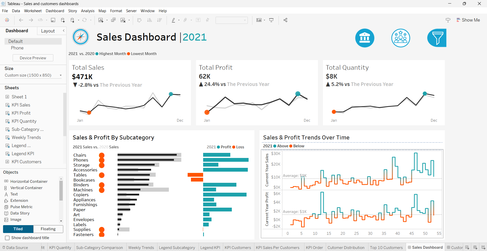
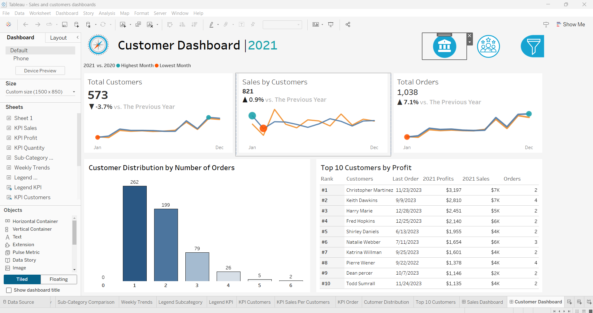

)

# Sales & Customer Performance Dashboards 

This project showcases **interactive Tableau dashboards** that analyze sales and customer performance.  
The dashboards were designed to support **sales managers, executives, and marketing teams** by providing clear insights into KPIs, trends, and customer behavior.

---

## Project Overview
The project includes two dashboards:

1. **Sales Dashboard**
   - Provides an overview of **Total Sales, Profit, and Quantity**.
   - Visualizes **monthly and weekly performance trends**.
   - Highlights best/worst performing months.
   - Compares **subcategories by sales & profit**.

2. **Customer Dashboard**
   - Provides insights into **Total Customers, Orders, and Sales per Customer**.
   - Displays **customer distribution by number of orders**.
   - Identifies **Top 10 Customers by Profit** with rank, orders, sales, and last order date.

---

## Data Modeling & Transformations
To achieve these dashboards, I created several **calculated fields** and **parameters** in Tableau:

- **Year-over-Year Comparison Fields**
  - Calculated fields to compare KPIs.

- **Dynamic Year Parameter**
  - Parameter allowing users to switch between years.
  - Enables historical comparison across KPIs.

- **Customer Segmentation**
  - Distribution fields to group customers by number of orders.
  - Ranking functions to identify top 10 customers.

---

## 📈 Dashboards Preview
### 🔹 Sales Dashboard

### 🔹 Customer Dashboard

## 🎯 Features & Interactivity
- **Filters** for Category, Subcategory, Region, State, City.  
- **Dynamic year selection** to explore historical data.  
- **Interactive charts** – click on visuals to filter across dashboards.  
- **Navigation buttons** between dashboards for smooth user experience.  

---

## 🧩 Tools & Skills Demonstrated
- **Tableau Desktop** – Dashboard design, calculated fields, parameters, and interactivity.  
- **Data Visualization** – KPI storytelling and trend analysis.  
- **Business Intelligence (BI)** – Sales performance monitoring and customer segmentation.  

---

## 📌 Key Takeaways
This project demonstrates:
- The ability to build **dynamic Tableau dashboards** aligned with business requirements.  
- Proficiency in **calculated fields, parameters, and YoY analysis**.  
- Skills in **data storytelling** to support decision-making.  

---

